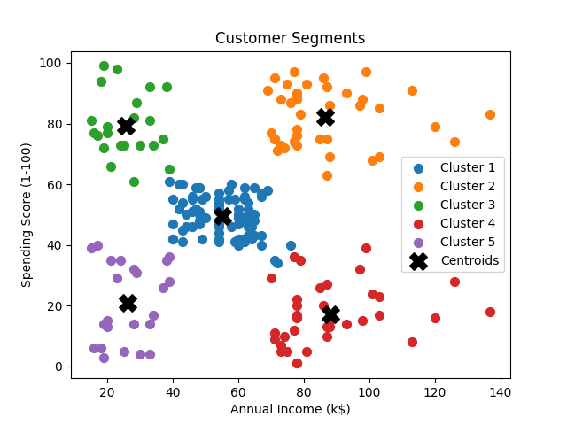
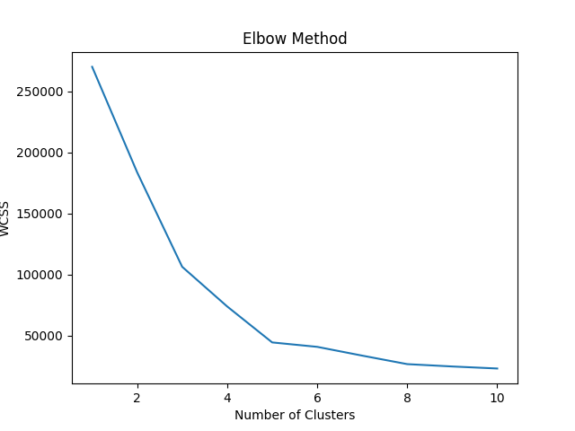

# K-Means Customer Segmentation

This project implements a **K-Means clustering algorithm** to group retail customers based on their purchasing behavior using **Annual Income** and **Spending Score**.

## Dataset
- Mall Customers Dataset (Kaggle)
- Features used:
  - Annual Income (k$)
  - Spending Score (1–100)

## Methodology
1. Loaded and preprocessed the dataset using Pandas
2. Applied the **Elbow Method** to determine the optimal number of clusters
3. Implemented **K-Means clustering** using Scikit-learn
4. Visualized customer segments and cluster centroids

##  Output
- Customer segmentation plot showing 5 distinct customer groups
- Elbow curve to justify the choice of clusters

##  Technologies Used
- Python
- Pandas
- Matplotlib
- Scikit-learn
- K-Means Clustering

## Files in Repository
- `group_customers.py` – Python implementation
- `Mall_Customers.csv` – Dataset
- `README.md` – Project documentation

## 📸 Visual Results

### Customer Segments

### Elbow Method

